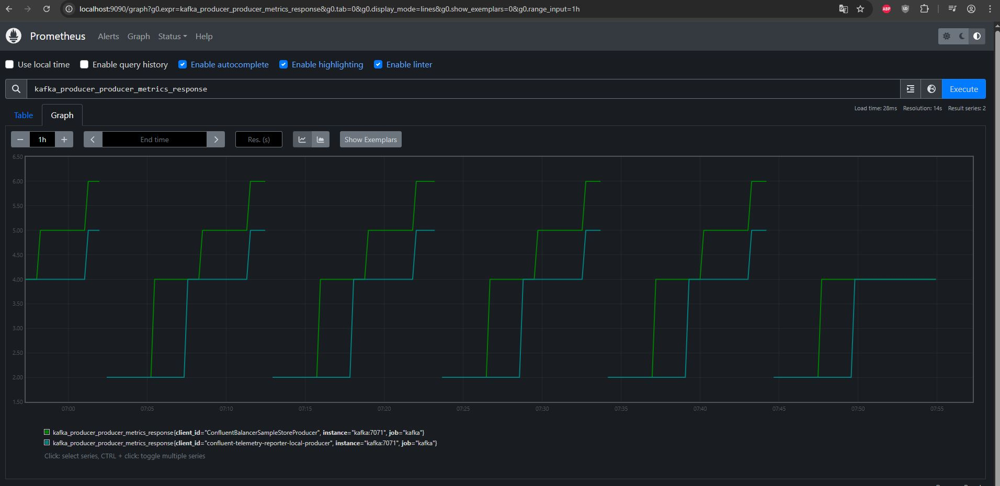

-PROYECTO-

El objetivo de este proyecto es principalmente aprender como funciona Kafka y como mostrar métricas sobre datos o eventos, almacenarlos y monitorearlos, también como desarrollar una arquitectura escalable y que facilite realizar cambios sin afectar a todo el código

## TECNOLOGÍAS UTILIZADAS

- Spring Boot
- Micrometer 
- Apache Kafka 
- Zookeeper 
- PostgreSQL 
- Prometheus 
- Grafana 
- Docker & Docker Compose 

## Requisitos previos

- Docker
- Docker Compose
- Java 21

-ACTUALIZACIÓN DEL PROYECTO-

De momento he conseguido mostrar métricas en Prometheus con kafka_producer_producer_metrics_response

Serguiré actualizando ya que mi intención es mostrar una gráfica donde se muestren datos como temperatura.

